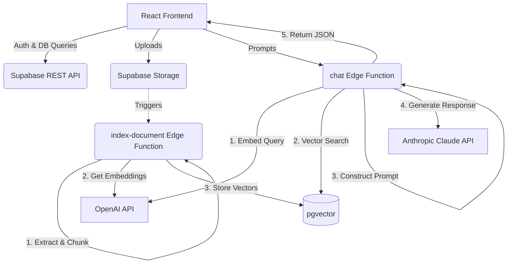

# AI Knowledge Copilot

A portfolio-grade Enterprise Retrieval-Augmented Generation (RAG) platform that empowers users to securely index company documents and chat intelligently with a context-aware AI assistant.

Built with a modern web stack: React, Vite, Tailwind CSS, TanStack Query, and Supabase.

---

## ⚡ Features

- **Document Ingestion**: Upload PDF, DOCX, TXT, or MD files securely to Supabase Storage.
- **Enterprise RAG Pipeline**: Edge functions automatically extract text, divide into semantic chunks, and generate OpenAI embeddings.
- **Vector Search**: PostgreSQL with `pgvector` powering fast and accurate HNSW similarity search to retrieve relevant document fragments.
- **Intelligent Chat**: Integration with Anthropic's Claude 3 via Edge Functions, backed by robust prompt engineering and citations.
- **Secure by Default**: Full Row Level Security (RLS) policies ensuring tenant isolation (Company ID) and user privacy.
- **Premium UI**: Dark-mode-first aesthetic with dynamic glassmorphism cards, shimmer skeleton loaders, smooth animations, and toast notifications.

---

## 🏗️ Architecture



---

## 🚀 Setup & Execution

### 1. Environment Variables
Create a `.env` file at the root combining your API keys and Supabase identifiers. See `.env.example` to get started:
```bash
cp .env.example .env
```

### 2. Supabase Initialization
Ensure you have the Supabase CLI installed, then link and apply the migrations:
```bash
supabase login
supabase init
supabase start
supabase db push
```

### 3. Install & Run
Install monorepo dependencies and spin up the frontend:
```bash
npm install
npm run dev
```

Visit `http://localhost:5173` to access the application.

---

## 🧠 RAG Pipeline Details

- **Chunking Strategy**: Documents are split into segments of approximately 800-1200 characters with a 150-250 character overlap to preserve contiguous semantic context.
- **Embeddings**: `text-embedding-3-small` model producing 1536-dimensional vectors.
- **Similarity Search**: Cosine similarity via `pgvector` HNSW indexes, supplying the top-K chunks to Claude for answer synthesis.

---

## 🛡️ Security Model

We utilize Supabase Row Level Security configured for firm tenant boundary enforcement.
Example policy using our custom firm identification:
```sql
CREATE POLICY "Users can only see their company's documents" 
ON documents 
FOR SELECT USING (company_id = get_current_user_company_id());
```

---

## 🎬 Demo Script

1. **Authentication**: Sign up a new user or log in at `/login`. Notice the branded glassmorphism layout and smooth transitions.
2. **Dashboard Overview**: Check `/dashboard` to see animated widgets showing your current vector footprint and session telemetry.
3. **Ingestion**: Navigate to `/documents`. Upload an employee handbook. A toast will confirm processing, and a shimmer skeleton will bridge the delay while the edge function indexes the file. You can test the vector creation by viewing the slide-out Chunk Viewer.
4. **Interrogation**: Open the `/chat` tab. Send a query like *"What is our corporate travel policy?"*. The platform will embed your query, do a semantic vector search, inject context to Claude, and stream back the answer complete with hyperlinked document citations.

---

## 🗺️ Roadmap

- [ ] Implementation of Optical Character Recognition (OCR) for scanned PDFs.
- [ ] Connectors for Google Drive and Confluence.
- [ ] Real-time streaming response (SSE) from Claude to the UI.
- [ ] Semantic query caching to reduce LLM token usage.
